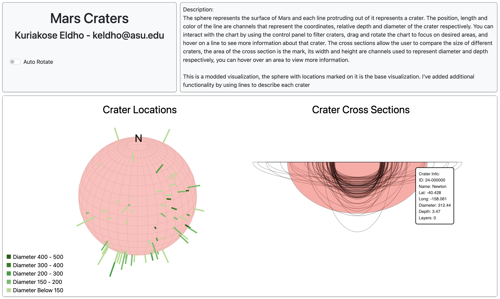

# Mars Crater Visualization

## Getting Started:

- Clone this repository to your local machine.
- Using a local server (such as HTTP Simple Server), open the **index.html** file.

## Dataset:

**Mars Crater Study Dataset** from Kaggle ([link](https://www.kaggle.com/datasets/codebreaker619/mars-crater-study-dataset)).

## Description:

The sphere represents the surface of Mars and each line protruding out of it represents a crater. The position, length and color of the line are channels that represent the coordinates, relative depth and diameter of the crater respectively. You can interact with the chart by using the control panel to filter craters, drag and rotate the chart to focus on desired areas, and hover on a line to see more information about that crater. The cross sections allow the user to compare the size of different craters, the area of the cross section is the mark, its width and height are channels used to represent diameter and depth respectively, you can hover over an area to view more information.

